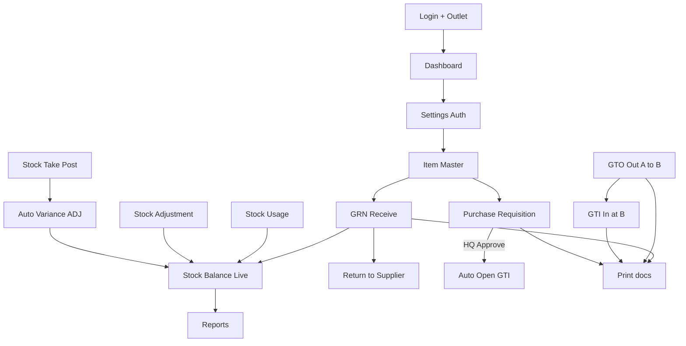

# React Inventory — UAT Test Checklist

**Purpose:** Step-by-step guide to test every menu and confirm workflows work correctly.  
**Audience:** Anyone (no QA experience needed).  
**How to use:** Follow sections in order. Mark each row **Pass / Fail / Skip**. Log bugs in the Bug Log at the end.

> **Short on time?**  
> - Menus only: `npm run test:e2e:smoke`  
> - Screenshots for manual: `npm run docs:screenshots` then `npm run docs:manual`  
> - Create GRN Save/Post (needs `E2E_ITEM_CODE`): `npm run test:e2e:workflows` → then **DB cleanup**  
> Setup: see [`e2e/README.md`](../e2e/README.md).  
> Full Save/Post/stock checks for every module: use this checklist.

---

## 0. How to use this document

### Before you start
1. Use a **test / UAT** environment (not live production if possible).
2. Keep this file open (or print it) and tick results as you go.
3. Use one notebook or Excel sheet for document numbers you create (you will need them later).
4. Test with at least **two outlets** if you can (e.g. Outlet A and Outlet B) — needed for transfer tests.
5. Prefer an HQ user **and** an outlet user for Purchase Requisition approval.

### Result codes
| Code | Meaning |
|------|---------|
| **Pass** | Worked exactly as expected |
| **Fail** | Broken, wrong data, crash, or error toast |
| **Skip** | Could not run (no auth, no data, feature not used) |

### When something fails
1. Note **menu name**, **step number**, **what you did**, **what you expected**, **what happened**.
2. Capture a screenshot if possible.
3. Copy any error toast / browser console error.
4. Add a row in **Section 20 — Bug Log**.

### Recommended test order (do not skip early steps)
```
Login → Dashboard → Settings (auth) → Item Master
  → GRN → Stock Balance Live
  → GTO (Outlet A→B) → GTI (at B)
  → RTN → SUM → ADJ → Stock Take
  → Purchase Requisition (outlet + HQ)
  → Purchase Order (optional)
  → Reports → Print checks → Logout
```

---

## 1. Test environment details

| Field | Fill in |
|-------|---------|
| Tester name | |
| Date | |
| App URL | |
| App version (from package / footer if any) | |
| Backend / API environment | |
| Browser (Chrome / Edge / etc.) | |
| Outlet A site code | |
| Outlet B site code | |
| Outlet test user | |
| HQ test user | |
| Batch enabled? (Yes/No) | |
| Expiry enabled? (Yes/No) | |
| Auto Post enabled? (Yes/No) | |

### Auth codes (for Settings / permission checks)

| Menu | Auth code |
|------|-----------|
| Goods Receive Note | F10001 |
| Goods Transfer Out | F10002 |
| Goods Transfer In | F10003 |
| Goods Return Note | F10004 |
| Stock Adjustment | F10005 |
| Stock Balance (live) | F10009 |
| Stock Usage Memo | F10010 |
| Stock Movement Report | F10011 |
| Purchase Requisition | F10012 |
| Stock Movement | F10013 |
| Stock Balance Report | F10014 |
| Stock Take | F10015 |
| Item Master | F10016 |

Settings menu appears only when `isSettingEnabled = Y` for the logged-in user.  
Replenishment Report and Dashboard are not auth-mapped the same way.

---

## 2. Smoke test — every menu opens

**Goal:** Confirm every sidebar link loads without a blank page or crash.  
**Login as:** user with full authorizations.

| # | Menu | URL | Expected | Pass/Fail | Notes |
|---|------|-----|----------|-----------|-------|
| S01 | Login page | `/login` | Username, Password, Outlet fields visible | | |
| S02 | Dashboard | `/dashboard` | Cards and sections load (or loading then data) | | |
| S03 | Goods Receive Note | `/goods-receive-note` | List / tabs / Create New | | |
| S04 | Goods Transfer Out | `/goods-transfer-out` | List loads | | |
| S05 | Goods Transfer In | `/goods-transfer-in` | List loads | | |
| S06 | Goods Return Note | `/goods-return-note` | List loads | | |
| S07 | Stock Adjustment | `/stock-adjustment` | List loads | | |
| S08 | Stock Usage Memo | `/stock-usage-memo` | List loads | | |
| S09 | Stock Balance (live) | `/stock-balance-live` | Stock table loads | | |
| S10 | Purchase Requisition | `/purchase-requisition` | List loads | | |
| S11 | Stock Take | `/stock-take` | List loads | | |
| S12 | Item Master | `/item-master` | Item list loads | | |
| S13 | Stock Balance Report | `/stock-balance` | Filter form visible | | |
| S14 | Stock Movement Report | `/stock-movement` | Filter form visible | | |
| S15 | Replenishment Report | `/replenishment-report` | Filter form visible | | |
| S16 | Settings | `/settings` | User authorization screen (if enabled) | | |
| S17 | Purchase Order (direct URL) | `/purchase-order` | List loads (not always in sidebar) | | |
| S18 | Logout | Sidebar Logout | Returns to login; protected pages blocked | | |

---

## 3. Login & security

| # | Steps | Expected | Pass/Fail | Notes |
|---|-------|----------|-----------|-------|
| L01 | Open app URL while logged out | Redirected to `/login` | | |
| L02 | Leave fields empty → Login | Error: fill the fields | | |
| L03 | Wrong password | Login rejected with clear message | | |
| L04 | Correct user + password + select Outlet A → Login | Goes to Dashboard | | |
| L05 | Refresh browser on Dashboard | Still logged in | | |
| L06 | Open `/login` while logged in | Redirected away from login (to app) | | |
| L07 | Logout | Back to login; cannot open `/dashboard` without login | | |
| L08 | Login with Outlet B | Dashboard / store context shows Outlet B | | |

---

## 4. Dashboard

| # | Steps | Expected | Pass/Fail | Notes |
|---|-------|----------|-----------|-------|
| D01 | Open Dashboard after login | Cards show: Total Stock Items, Pending Documents, Last 30 Days Transactions, In Stock Count | | |
| D02 | Check Low Stock Alert | Shows items matching reorder rule, or empty if none | | |
| D03 | Check Recent Transactions | Recent docs listed (or empty) | | |
| D04 | Check Top Stock by Value | Stock rows visible | | |
| D05 | Click View stock / stock balance link if shown | Opens Stock Balance Live | | |
| D06 | Click a stock row that opens batch detail (if batches on) | Batch modal opens with data or empty | | |

---

## 5. Settings — User Authorization

*Only if Settings menu is visible (`isSettingEnabled = Y`).*

| # | Steps | Expected | Pass/Fail | Notes |
|---|-------|----------|-----------|-------|
| SET01 | Open Settings | User list / authorization toggles load | | |
| SET02 | Select a test user | Form codes (F10001…) shown with Active Y/N | | |
| SET03 | Turn off Item Master (F10016) → Save/Update | Change saved | | |
| SET04 | Logout → login as that user | Item Master menu hidden or blocked | | |
| SET05 | Re-enable F10016 for that user | Menu returns after re-login / refresh | | |
| SET06 | Confirm Stock Control menus match granted codes | Only authorized menus visible | | |

---

## 6. Item Master

**Paths:** List `/item-master` · Add `/item-master/add` · Edit `/item-master/edit/:itemCode`

### 6.1 List

| # | Steps | Expected | Pass/Fail | Notes |
|---|-------|----------|-----------|-------|
| IM01 | Open Item Master | List of items loads | | |
| IM02 | Search by item code / name | Results filter correctly | | |
| IM03 | Tabs: All / Active / Inactive | Correct filtering | | |
| IM04 | Pagination (if many items) | Next/prev works | | |
| IM05 | Click **+ Create New** | Opens add form | | |
| IM06 | Click an existing item | Opens edit form with data filled | | |

### 6.2 Create item (minimum viable)

| # | Steps | Expected | Pass/Fail | Notes |
|---|-------|----------|-----------|-------|
| IM07 | Fill Division, Dept, Brand, Range, Class, Stock Type, Stock Name | Fields accept values; Item Code auto-builds from prefix where applicable | | |
| IM08 | Set cost / price / barcodes as needed | Values stick | | |
| IM09 | Ensure item is Active | Active flag on | | |
| IM10 | Add at least one UOM with price | UOM row saved on Create | | |
| IM11 | Optionally set Reorder Active + Min Qty (> 0) | Needed later for Replenishment / Dashboard low stock | | |
| IM12 | Click **Create Item** | Success toast; item appears in list | | |
| IM13 | Write down Item Code: _______________ | Used in GRN / PR / etc. | | |

### 6.3 Edit & sections smoke

| # | Steps | Expected | Pass/Fail | Notes |
|---|-------|----------|-----------|-------|
| IM14 | Open the new item → change name → **Update Item** | Success; list shows new name | | |
| IM15 | Open UOM section → add/edit UOM → Update | Persists after reopen | | |
| IM16 | Open Stock Listing / Stk.Balance | Site qty view loads | | |
| IM17 | Open Package / Service Option / Item Content / Link (if used by your business) | Section opens without crash | | |
| IM18 | Open Voucher / Prepaid sections (if division requires them) | Fields editable without crash | | |
| IM19 | Cancel from form | Returns to list; no unintended save | | |

---

## 7. Goods Receive Note (GRN)

**Paths:** List `/goods-receive-note` · Add `/goods-receive-note/add` · Print `/goods-receive-note/print/:docNo`  
**Auth:** F10001 · **Statuses:** Open (0) / Posted (7)

### 7.1 List

| # | Steps | Expected | Pass/Fail | Notes |
|---|-------|----------|-----------|-------|
| GRN01 | Open GRN list | Documents load | | |
| GRN02 | Search by Doc / Ref / Qty | Filters work | | |
| GRN03 | Filter by supplier (if shown) | Filters work | | |
| GRN04 | Tabs All / Open / Posted | Correct status filter | | |
| GRN05 | Click **+ Create New** | Add form opens | | |

### 7.2 Create → Save (Open)

| # | Steps | Expected | Pass/Fail | Notes |
|---|-------|----------|-----------|-------|
| GRN06 | Check Doc No auto-filled, Doc Date set, Store = login site | Header defaults correct | | |
| GRN07 | Select **Supplier (Supply No)** *required* | Required | | |
| GRN08 | Set **Delivery Date**, **Term** *required* | Required | | |
| GRN09 | Optional: Ref1, Ref2, Remarks | Saved later | | |
| GRN10 | Search and add Item Code from IM13 | Item appears in cart | | |
| GRN11 | Enter Qty > 0 and Price > 0 | Accepted | | |
| GRN12 | If Batch/Expiry enabled: enter Batch No / Expiry | Required when config = Yes | | |
| GRN13 | Try Save with empty cart | Blocked with error | | |
| GRN14 | Add line(s) → **Save** | Success; Status = Open | | |
| GRN15 | Doc No created: _______________ | | |

### 7.3 Post & verify stock

| # | Steps | Expected | Pass/Fail | Notes |
|---|-------|----------|-----------|-------|
| GRN16 | Open the Open GRN → **Post** | Status becomes Posted | | |
| GRN17 | Open Stock Balance Live for that item | On-hand qty **increased** by GRN qty | | |
| GRN18 | If batches on: open batch detail | Batch qty matches | | |
| GRN19 | Try editing Posted GRN (without posted-edit permission) | Mostly read-only | | |
| GRN20 | Printer icon from list | Print preview opens for GRN | | |

---

## 8. Goods Transfer Out (GTO) → Goods Transfer In (GTI)

**GTO:** `/goods-transfer-out` · Auth F10002 · movCode TFRT  
**GTI:** `/goods-transfer-in` · Auth F10003 · movCode TFRF

### 8.1 GTO — Outlet A → Outlet B

| # | Steps | Expected | Pass/Fail | Notes |
|---|-------|----------|-----------|-------|
| GTO01 | Login as Outlet A | | | |
| GTO02 | Open GTO → Create New | Form opens | | |
| GTO03 | From Store = A, select **To Store = B** (must differ) | Required before lines | | |
| GTO04 | Add item that has stock at A; Qty ≤ on-hand | Cannot exceed available | | |
| GTO05 | Try Qty > on-hand | Blocked | | |
| GTO06 | Save Open | Open GTO created: _______________ | | |
| GTO07 | Post GTO | Posted; stock at A **decreases** | | |
| GTO08 | Verify Records (list button) if available | Own-site outbound list loads | | |
| GTO09 | Print GTO | Print preview OK | | |

### 8.2 GTI — receive at Outlet B

| # | Steps | Expected | Pass/Fail | Notes |
|---|-------|----------|-----------|-------|
| GTI01 | Login as Outlet B | | | |
| GTI02 | If AUTO_POST = Yes: check stock at B already increased after GTO Post | Stock may already be updated | | |
| GTI03 | If AUTO_POST = No: Create GTI; From Store = A, To Store = B | Form validates From ≠ To | | |
| GTI04 | Add same item / qty → Save → Post | Stock at B **increases** | | |
| GTI05 | Verify Records (inbound) | Loads | | |
| GTI06 | Print GTI | Print preview OK | | |

**Write down:** GTO Doc _______________ · GTI Doc _______________

---

## 9. Goods Return Note (RTN)

**Path:** `/goods-return-note` · Auth F10004 · Returns stock to supplier (decreases stock)

| # | Steps | Expected | Pass/Fail | Notes |
|---|-------|----------|-----------|-------|
| RTN01 | Open RTN list → Create New | Form opens | | |
| RTN02 | Select Supplier, Delivery Date, Term | Required like GRN | | |
| RTN03 | Add item with available stock; Qty ≤ on-hand | Accepted | | |
| RTN04 | Try Qty > stock | Blocked | | |
| RTN05 | Save Open → Post | Posted; stock **decreases** | | |
| RTN06 | Confirm Stock Balance Live | Qty reduced | | |
| RTN07 | Print RTN | Print preview OK | | |
| RTN08 | Doc No: _______________ | | |

---

## 10. Stock Usage Memo (SUM)

**Path:** `/stock-usage-memo` · Auth F10010 · Consumes stock

| # | Steps | Expected | Pass/Fail | Notes |
|---|-------|----------|-----------|-------|
| SUM01 | Create New SUM | Form opens; Store = login site | | |
| SUM02 | Add item with Usage Qty / Price | Cart accepts | | |
| SUM03 | Save Open → Post | Posted; stock **decreases** | | |
| SUM04 | Confirm Stock Balance Live | Qty reduced | | |
| SUM05 | Print SUM | Print preview OK | | |
| SUM06 | Doc No: _______________ | | |

---

## 11. Stock Adjustment (ADJ)

**Path:** `/stock-adjustment` · Auth F10005  
**Rule:** Positive qty = increase · Negative qty = decrease

| # | Steps | Expected | Pass/Fail | Notes |
|---|-------|----------|-----------|-------|
| ADJ01 | Create New ADJ | Form opens | | |
| ADJ02 | Add item with **positive** Qty → Save → Post | Stock **increases** | | |
| ADJ03 | Create another ADJ with **negative** Qty (not more than on-hand) → Post | Stock **decreases** | | |
| ADJ04 | Try negative Qty larger than stock | Blocked | | |
| ADJ05 | Try Qty = 0 | Blocked | | |
| ADJ06 | Print ADJ | Print preview OK | | |
| ADJ07 | Doc Nos: + _______________ / − _______________ | | |

---

## 12. Stock Take (TKE)

**Path:** `/stock-take` · Auth F10015  
**Important:** Posted status here is **1** (not 7). Posting can auto-create a variance **Stock Adjustment**.

| # | Steps | Expected | Pass/Fail | Notes |
|---|-------|----------|-----------|-------|
| TKE01 | Create New Stock Take | Step 1: Select Items | | |
| TKE02 | Filter / search stocks; select some checkboxes | Selection works | | |
| TKE03 | Print Selected / Print All (if shown) | Print works or opens preview | | |
| TKE04 | Click **Next** | Step 2: enter Counted Qty | | |
| TKE05 | Enter counted qty different from system qty on at least one line | Variance visible | | |
| TKE06 | Tick Confirm Update per line as required | Cannot post without confirm where required | | |
| TKE07 | **Save** | Status Open (0); editable | | |
| TKE08 | **Post** | Status Posted (1); non-editable | | |
| TKE09 | Check if variance ADJ was created in Stock Adjustment list | Matching adjustment exists | | |
| TKE10 | Confirm Stock Balance matches counted qty for posted lines | Stock corrected | | |
| TKE11 | Print Stock Take from list | Print preview OK | | |
| TKE12 | Doc No: _______________ | | |

---

## 13. Stock Balance Live

**Path:** `/stock-balance-live` · Auth F10009 · Inquiry only (no Save/Post)

| # | Steps | Expected | Pass/Fail | Notes |
|---|-------|----------|-----------|-------|
| SB01 | Open Stock Balance Live | Table loads for login site | | |
| SB02 | Search by code / name / brand | Filters | | |
| SB03 | Tabs All / Retail / Salon | Filters | | |
| SB04 | Sort columns if clickable | Sort works | | |
| SB05 | Click row → batch modal (if batches on) | Batch breakdown for site | | |
| SB06 | Spot-check item used in GRN/GTO/RTN/SUM/ADJ/TKE | Qty matches expected after each posted doc | | |

---

## 14. Purchase Requisition (PR)

**Path:** `/purchase-requisition` · Auth F10012  
**Statuses:** Open → Posted → Approved | Rejected  
**Special:** HQ **Approve PR** can auto-create an **Open GTI** at the requesting outlet.

### 14.1 Outlet creates PR

| # | Steps | Expected | Pass/Fail | Notes |
|---|-------|----------|-----------|-------|
| PR01 | Login as Outlet A → Create New PR | Form opens; Store readonly = A | | |
| PR02 | Request To (often HQ) selected | Required | | |
| PR03 | Add lines: Requested Qty > 0, Price, UOM | Cart valid | | |
| PR04 | Save | Status Open | | |
| PR05 | Post | Status Posted | | |
| PR06 | Print PR | Print preview OK | | |
| PR07 | PR No: _______________ | | |

### 14.2 HQ approve / reject

| # | Steps | Expected | Pass/Fail | Notes |
|---|-------|----------|-----------|-------|
| PR08 | Login as HQ → open PR list (approval view) | Sees outlet PRs | | |
| PR09 | Open Posted PR → **Reject** without reason | Blocked (reason required) | | |
| PR10 | Reject with reason (use a second test PR if needed) | Status Rejected | | |
| PR11 | Approve a Posted PR | Status Approved | | |
| PR12 | At Outlet A: check GTI list for new **Open GTI** | Auto-created when design expects it | | |
| PR13 | Complete/Post that GTI if created | Stock updates correctly | | |

---

## 15. Purchase Order (PO) — optional

**Path:** `/purchase-order` (often **not** in sidebar — open URL directly)  
**Print:** No dedicated print route in app currently.

| # | Steps | Expected | Pass/Fail | Notes |
|---|-------|----------|-----------|-------|
| PO01 | Open `/purchase-order` | List loads | | |
| PO02 | Create New: Supplier, PO Date, lines with Qty/Price | Valid | | |
| PO03 | Save → Post | Open then Posted | | |
| PO04 | Tabs Open / Posted / Approved | Filter works | | |
| PO05 | Note: GRN does not currently pick PO in UI | Standalone receive still works via GRN | | |
| PO06 | PO No: _______________ | | |

---

## 16. Reports

### 16.1 Stock Balance Report — `/stock-balance` · Auth F10014

| # | Steps | Expected | Pass/Fail | Notes |
|---|-------|----------|-----------|-------|
| RPT01 | Open report | Filters visible | | |
| RPT02 | Leave Site or As on Date empty → Generate | Validation error for required fields | | |
| RPT03 | Select Site + As on Date → **Generate Report** | Results table loads | | |
| RPT04 | Optional filters: Dept, Brand, Range, Item, Show 0 Qty, Show Inactive | Results change accordingly | | |
| RPT05 | Export (Excel/PDF if offered) | File downloads | | |

### 16.2 Stock Movement Report — `/stock-movement` · Auth F10011

| # | Steps | Expected | Pass/Fail | Notes |
|---|-------|----------|-----------|-------|
| RPT06 | From Date / To Date required; From ≤ To | Validation works | | |
| RPT07 | Generate with dates only | Results (all sites if Site empty) | | |
| RPT08 | Filter by Movement Code (GRN/GTO/etc.) for a known doc | Known transaction appears | | |
| RPT09 | Export | File downloads | | |

### 16.3 Replenishment Report — `/replenishment-report`

| # | Steps | Expected | Pass/Fail | Notes |
|---|-------|----------|-----------|-------|
| RPT10 | Site required → Generate | Shows items where reorder active, min qty > 0, on-hand ≤ min | | |
| RPT11 | Use item from IM11 if on-hand ≤ reorder min | Item appears | | |
| RPT12 | Export | File downloads | | |

---

## 17. Print matrix (all printable documents)

From each document list, click the **printer icon** for a Posted (or Open) document.

| # | Document | Print route works? | Layout readable? | Pass/Fail | Notes |
|---|----------|--------------------|------------------|-----------|-------|
| P01 | GRN | | | | |
| P02 | GTO | | | | |
| P03 | GTI | | | | |
| P04 | RTN | | | | |
| P05 | ADJ | | | | |
| P06 | SUM | | | | |
| P07 | Stock Take | | | | |
| P08 | Purchase Requisition | | | | |

---

## 18. Cross-module end-to-end scenarios

Run these after individual module tests. They catch “menu works alone but chain breaks” issues.

### Scenario A — New item to stock to report
| # | Flow | Expected | Pass/Fail | Notes |
|---|------|----------|-----------|-------|
| E2E-A1 | Create Item Master item | Item exists | | |
| E2E-A2 | GRN receive qty 10 → Post | Stock = +10 | | |
| E2E-A3 | Stock Balance Live | Shows 10 | | |
| E2E-A4 | Stock Movement Report for today | GRN line appears | | |
| E2E-A5 | Dashboard cards / recent tx | Reflect new activity | | |

### Scenario B — Inter-outlet transfer
| # | Flow | Expected | Pass/Fail | Notes |
|---|------|----------|-----------|-------|
| E2E-B1 | At A: stock exists | | | |
| E2E-B2 | GTO A→B Post | A decreases | | |
| E2E-B3 | GTI at B Post (or AUTO_POST) | B increases | | |
| E2E-B4 | Movement report both sites | TFRT / TFRF visible | | |

### Scenario C — Consume & adjust
| # | Flow | Expected | Pass/Fail | Notes |
|---|------|----------|-----------|-------|
| E2E-C1 | SUM Post | Stock down | | |
| E2E-C2 | ADJ + Post | Stock up | | |
| E2E-C3 | ADJ − Post | Stock down | | |
| E2E-C4 | RTN Post | Stock down | | |

### Scenario D — Stock take correction
| # | Flow | Expected | Pass/Fail | Notes |
|---|------|----------|-----------|-------|
| E2E-D1 | Note system qty for item | | | |
| E2E-D2 | Stock Take with different counted qty → Post | Status Posted=1 | | |
| E2E-D3 | Auto ADJ created (if variance) | ADJ exists | | |
| E2E-D4 | Stock Balance = counted qty | Matches | | |

### Scenario E — PR approval to GTI
| # | Flow | Expected | Pass/Fail | Notes |
|---|------|----------|-----------|-------|
| E2E-E1 | Outlet PR → Post | Posted | | |
| E2E-E2 | HQ Approve | Approved | | |
| E2E-E3 | Outlet sees Open GTI | Created | | |
| E2E-E4 | Post GTI | Stock updated | | |

---

## 19. Negative / edge checks (quick)

| # | Check | Expected | Pass/Fail | Notes |
|---|-------|----------|-----------|-------|
| NEG01 | Post document with no lines | Blocked | | |
| NEG02 | Qty 0 or blank on line | Blocked | | |
| NEG03 | Price 0 where price required | Blocked or warned per module | | |
| NEG04 | GTO/GTI From Store = To Store | Blocked | | |
| NEG05 | Transfer/return more than on-hand | Blocked | | |
| NEG06 | Cancel button mid-form | Returns to list; no partial bad post | | |
| NEG07 | Open same Posted doc in two tabs and re-post (if possible) | No double stock effect / clear error | | |
| NEG08 | User without F10001 | GRN menu hidden | | |
| NEG09 | Network offline mid-save (optional) | Clear error; no silent success | | |

---

## 20. Bug Log

| Bug ID | Date | Menu / Step | Severity (Blocker/Major/Minor) | Steps to reproduce | Expected | Actual | Screenshot? | Status |
|--------|------|-------------|--------------------------------|--------------------|----------|--------|-------------|--------|
| BUG-001 | | | | | | | | Open |
| BUG-002 | | | | | | | | |
| BUG-003 | | | | | | | | |

**Severity guide**
- **Blocker:** Cannot complete core flow (login, post stock, open menu)
- **Major:** Wrong stock qty, wrong status, missing save, print broken for business-critical docs
- **Minor:** UI glitch, sort issue, cosmetic, label typo

---

## 21. Sign-off

| Role | Name | Date | Overall result (Pass / Pass with issues / Fail) | Signature |
|------|------|------|--------------------------------------------------|-----------|
| Tester | | | | |
| Reviewer | | | | |

### Summary counts (fill after run)
| Metric | Count |
|--------|-------|
| Total cases run | |
| Passed | |
| Failed | |
| Skipped | |
| Open bugs | |
| Blockers | |

---

## Appendix A — Document number scratchpad

| Module | Doc / Item No | Outlet | Qty | Status after test |
|--------|---------------|--------|-----|-------------------|
| Item Master | | | | |
| GRN | | | | |
| GTO | | | | |
| GTI | | | | |
| RTN | | | | |
| SUM | | | | |
| ADJ + | | | | |
| ADJ − | | | | |
| Stock Take | | | | |
| PR | | | | |
| PO | | | | |
| Auto ADJ from TKE | | | | |
| Auto GTI from PR | | | | |

## Appendix B — Common button meanings

| Button | Typical meaning |
|--------|-----------------|
| **Save** | Keep as **Open** (editable draft) |
| **Post** | Finalize; usually updates stock; becomes **Posted** |
| **Cancel** | Leave form without saving current action |
| **Approve / Reject** | HQ decision on PR |
| **Create Item / Update Item** | Item Master only |

## Appendix C — Workflow diagram



---

*Generated for React Inventory UAT. Keep this checklist with each release; tick only what you re-tested after changes.*
